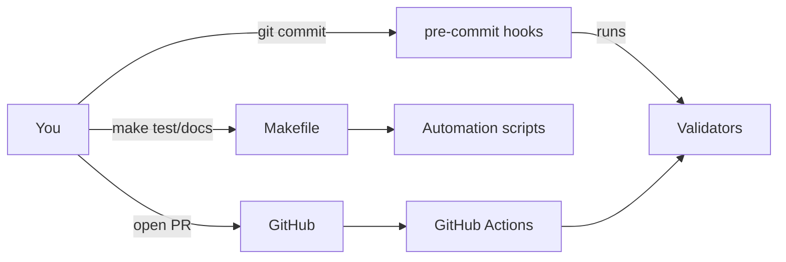

# DevOps Handbook (CourtIQ)

This handbook is the **map** of our tooling and automation. Each section is short, practical, and links to a deeper page.

> Goal: Anyone (including future-you) can explain every moving part in 5–10 minutes.

---

### Getting Started

> 1) `make onboard` (or `scripts/onboard.sh`)  
> 2) `make help` to see commands  
> 3) `make tour` for a guided doc walkthrough


---
### Command Map
- ➡️ See: [`docs/COMMAND_MMP.md`](COMMAND_MAP.md)
---

## Makefile — what/why/how
- **What:** A command menu for project tasks (`make test`, `make check`, `make docs`).
- **Why:** Short, memorable commands; consistent across machines.
- **How:** Targets + comments (we use a “self-documenting” pattern).
- ➡️ See: `docs/SCRIPTS.md` (for generator), `Makefile` (run `make help`)


## Pre-commit Hooks
- **What:** Local checks that run **before** a commit (validators, linters, etc.).
- **Why:** Prevents “oops” commits; keeps ROADMAP/TECH_DEBT aligned with `meta/plan.yml`.
- **How:** `.pre-commit-config.yaml` + `pre-commit install`.
- ➡️ See: [`docs/PRE_COMMIT.md`](PRE_COMMIT.md)

## YAML in This Repo
- **What:** Configuration files (GitHub Actions, `meta/plan.yml`, pre-commit).
- **Why:** Declarative config → predictable automation.
- **How:** Keys, anchors, and patterns we actually use (no theory overload).
- ➡️ See: [docs/YAML_GUIDE.md](YAML_GUIDE.md)

## Automation Scripts (`tools/*.py`, `scripts/*.sh`)
- **What:** Small, single-purpose helpers (PR generator, tech-debt CLI).
- **Why:** Replace manual, error-prone edits with commands.
- **How:** Each script has a “What/Why/Usage” header; a doc generator builds a reference page.
- ➡️ See: (to be added) `` (auto-generated)
- ➡️ See: [`docs/SCRIPTS.md`](SCRIPTS.md)


## Validators
- **What:** `tools/validate_structure.py` + `tools/validate_plan.py`
- **Why:** Keep structure and plan/docs aligned.
- **How:** Run locally (`make check`) and in CI.
- ➡️ See: (to be added) `docs/VALIDATORS.md` (optional)

---

## How these pieces fit (bird’s-eye view)


```mermaid
flowchart LR
  dev[You] -->|git commit| precommit[pre-commit hooks]
  precommit -->|runs| validators[Validators]
  dev -->|make test/docs| make[Makefile]
  make --> scripts[Automation scripts]
  dev -->|open PR| gh[GitHub]
  gh --> actions[GitHub Actions]
  actions --> validators
```

**Reading order (recommended):**

1.  Makefile → 2) Pre-commit → 3) YAML basics → 4) Scripts → 5) Validators

> Tip: After each coding day, add a tiny "ELI5 + Expert Notes" block to one topic here.

---

## Weekly System Tour (10–15 min)

**Goal:** Strengthen “explain-anything” fluency by documenting one plumbing piece each week.

**Checklist**
1. Pick one artifact you touched (Makefile target, pre-commit hook, CI job, script).
2. Add an entry in `docs/system-tours/` named `YYYY-MM-DD.md`.
3. Write two blocks:
   - **ELI5:** explain like to a junior dev (5–8 sentences).
   - **Expert Notes:** 3 bullets (gotchas, debug tips, edge cases).
4. If relevant, add a small mermaid sketch (sequence or flow).
5. Link the new entry back here.

**Template (paste into each new file)**

# System Tour — YYYY-MM-DD — <Topic>

## ELI5
<short plain-language explanation>

## Expert Notes
- <gotcha or nuance>
- <debug tip>
- <edge case or tradeoff>

## Diagram (optional)
```mermaid
flowchart LR
  A[Trigger] --> B[Tool/Hook]
  B --> C[Outcome]
  ```

**Index**
- [ ] (add links as you create tour notes)


