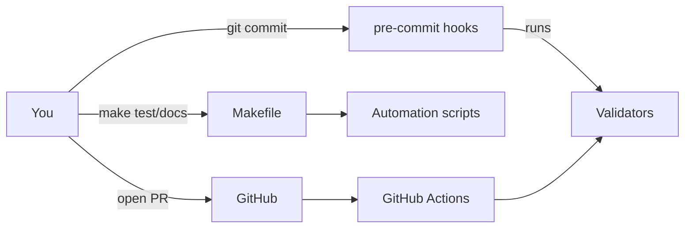

# DevOps Handbook (CourtIQ)

This handbook is the **map** of our tooling and automation. Each section is short, practical, and links to a deeper page.

> Goal: Anyone (including future-you) can explain every moving part in 5–10 minutes.

---

## Makefile — what/why/how
- **What:** A command menu for project tasks (`make test`, `make check`, `make docs`).
- **Why:** Short, memorable commands; consistent across machines.
- **How:** Targets + comments (we use a “self-documenting” pattern).
- ➡️ See: (to be added) `docs/MAKEFILE_GUIDE.md`

## Pre-commit Hooks
- **What:** Local checks that run **before** a commit (validators, linters, etc.).
- **Why:** Prevents “oops” commits; keeps ROADMAP/TECH_DEBT aligned with `meta/plan.yml`.
- **How:** `.pre-commit-config.yaml` + `pre-commit install`.
- ➡️ See: (to be added) `docs/PRE_COMMIT.md`

## YAML in This Repo
- **What:** Configuration files (GitHub Actions, `meta/plan.yml`, pre-commit).
- **Why:** Declarative config → predictable automation.
- **How:** Keys, anchors, and patterns we actually use (no theory overload).
- ➡️ See: (to be added) `docs/YAML_GUIDE.md`

## Automation Scripts (`tools/*.py`, `scripts/*.sh`)
- **What:** Small, single-purpose helpers (PR generator, tech-debt CLI).
- **Why:** Replace manual, error-prone edits with commands.
- **How:** Each script has a “What/Why/Usage” header; a doc generator builds a reference page.
- ➡️ See: (to be added) `docs/SCRIPTS.md` (auto-generated)

## Validators
- **What:** `tools/validate_structure.py` + `tools/validate_plan.py`
- **Why:** Keep structure and plan/docs aligned.
- **How:** Run locally (`make check`) and in CI.
- ➡️ See: (to be added) `docs/VALIDATORS.md` (optional)

---

## How these pieces fit (bird’s-eye view)

**Reading order (recommended):**

1.  Makefile → 2) Pre-commit → 3) YAML basics → 4) Scripts → 5) Validators

> Tip: After each coding day, add a tiny "ELI5 + Expert Notes" block to one topic here.

---